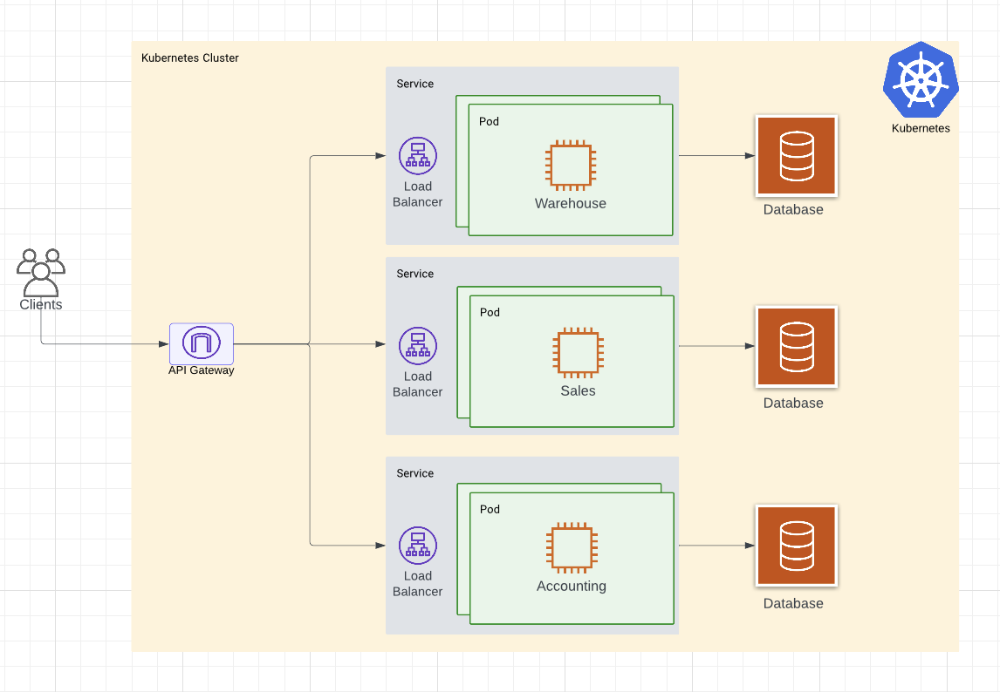
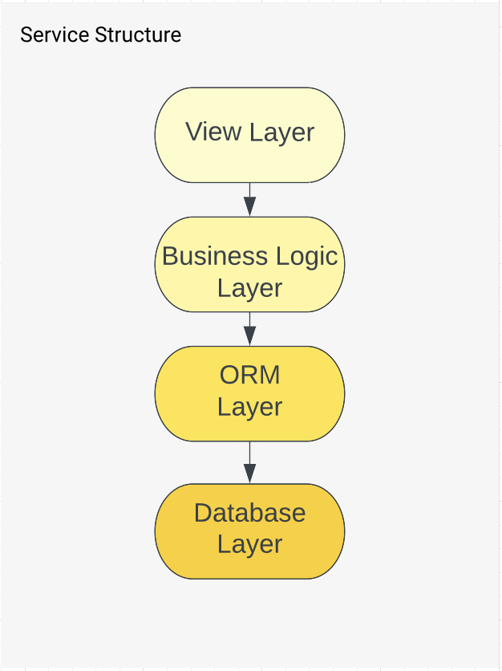
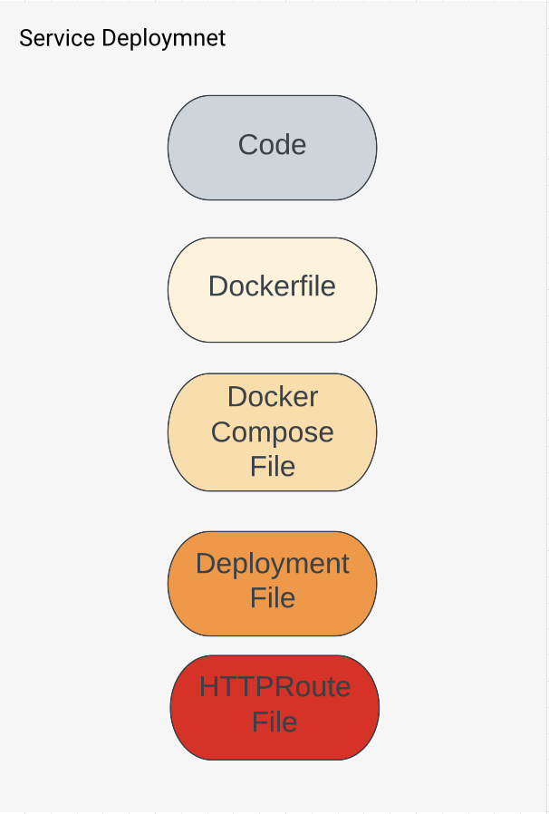

# Small business: microservices

[](https://github.com/psf/black)
[](https://github.com/BarabanovaIrina/small_business_ms/actions)
[](https://github.com/BarabanovaIrina/small_business_ms/actions)
[](https://codecov.io/github/BarabanovaIrina/small_business_ms)

## Project description

Create a single API that seamlessly exposes the data
of three different systems: Warehouse, Accounting, Sales.
The system should be available 24/7, scalable, resilient to failures,
and the data should be available through different offices around the world.

### Mian requirements

- ~~Design the architecture of the new system and explain your reasons to use it~~
- ~~Code at least three microservices with the best code quality possible
  and expose them via a REST API~~
- ~~The software artifacts should be covered by unit tests~~
- ~~The software artifacts should be easy to package and deploy~~

### Extra requirements

- ~~Provide any document or diagram useful to explain your proposal~~
- Applications covered by acceptance tests suites
- ~~Define the software technologies that should be used to build a system
  that’s scalable, reliable, and distributed.~~
- Describe your ideal development workflow considering stability, security,
  and agility from the beginning.
- Define a versioning policy and a strategy to deploy in production
- Automatically generated documentation
- Mention the software technologies to build your ideal CI/CD environment
- ~~Fully functional CI workflow~~
- Fully functional CD workflow

## Design

Stack: Python, Django, Postgres, Kubernetes, NGINX

**Why Django?** Personal curiosity, because I've never worked with it.

**Why Kubernetes?** Kubernetes allows easily scale services and make clear
intra-service communication.

**Why Postgres?** This is the most common enterprise DB solution.

**Why NGINX?** It provides the ability to run API Gateway in Kubernetes Cluster

### What is planned to be Done:

The whole system is supposed to be deployed in a Kubernetes cluster and have cluster
API Gateway to all the services.



### What is Done at the moment

<table border="0">
 <tr>
    <td><b style="font-size:20px">Service</b></td>
    <td><b style="font-size:20px">Deploy</b></td>
 </tr>
 <tr>
    <td>Each service has several layers, which are flexible to extend and replace.

</td>

<td>Each service(django project) has the following files to be able to work with
other services within a Kubernetes cluster:

</td>

 </tr>
</table>

**Intra-service communication**

At the moment, the is only one intra-service communication between
Sales and Warehouse which is accessible via the following endpoint:

```shell
curl "http://<GATEWAY_IP>:<GATEWAY_PORT>/sales/sold_items"
```

### Running services under Docker:

This will run 3 separate services with databases

1. ```shell
   sh small_business_ms/k8s/run_services.sh
   ```
2. Use `warehouse.init_data.sql`, `accounting.init_data.sql`
   and `sales.init_data.sql` scripts to fill in some data (I'm using DBeaver)
3. Use the corresponding [Postman collections](<(https://github.com/BarabanovaIrina/small_business_ms/blob/master/docs/postman/)>) to run.

### Local Cluster setup:

1.  You may use any local kubernetes services you like, but this project
    was run under Docker Desktop Kubernetes. Do the following steps to use it:

    1. From the Docker Dashboard, select the Settings.
    2. Select Kubernetes from the left sidebar.
    3. Next to Enable Kubernetes, select the checkbox.
    4. Select Apply & Restart to save the settings and then click Install to confirm.

       [More information](https://docs.docker.com/desktop/kubernetes/) about Kubernetes
       under Docker Desktop you may find following the link.

2.  Please, make sure you have kubectl installed. If not, use the [instructions](https://kubernetes.io/docs/tasks/tools/)
    to install

3.  Using git bash or terminal(macOS) run the following commands:

    1. Choose a directory you want to clone a project and run:

    ```shell
    git clone git@github.com:BarabanovaIrina/small_business_ms.git
    ```

    2. Without changing the directory run build all services necessary images:

    ```shell
    sh small_business_ms/k8s/build_images.sh
    ```

    3. Build NGINX API Gateway and enable port forwarding:

    ```shell
    sh small_business_ms/k8s/deploy_all.sh
    ```

    4. If you face issues like `Internal error occurred`, please,
       run the previous step again. That might happen when parts take
       some time to deploy.

    5. As a final result you should see port forwarding messages:

    ```shell
    Forwarding from 127.0.0.1:8080 -> 80
    Forwarding from [::1]:8080 -> 80
    Forwarding from 127.0.0.1:8443 -> 443
    Forwarding from [::1]:8443 -> 443
    ```

There is a [Postman collection](https://github.com/BarabanovaIrina/small_business_ms/blob/master/docs/postman/small_business.postman_collection.json) with all the available(at the moment) requests
you may test.

### What is yet to be Done:

- ~~Replace dummy Dict database with a real Postgres database~~
- ~~Extend CRUD for other services~~
- Come up with a scenario of using message bus in intra-service communication
- ~~Create CD pipelines~~
- Add auto-documentation
- Fix imports in test or divide services into separate repositories
